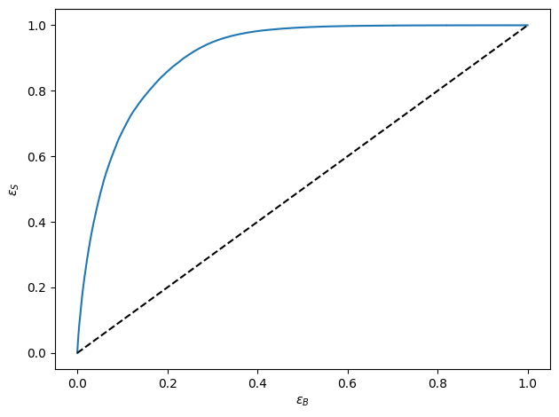
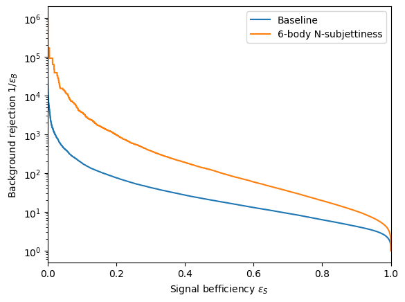
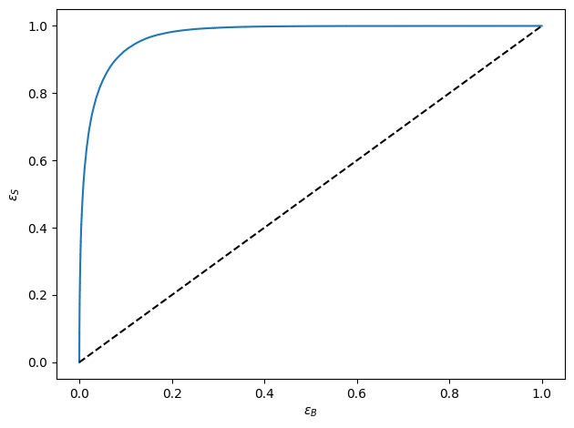
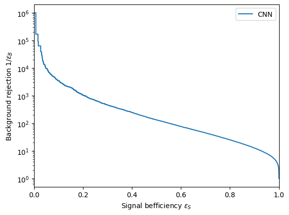

# Jet Tagging
Analysing the Top Quark Tagging dataset, which is a famous benchmark that’s used to compare the performance of jet classification algorithms. The dataset consists of around 2 million Monte Carlo simulated events in proton-proton collisions that have been clustered into jets.

Framed as a supervised machine learning task, the goal is to train a model that can classify each jet as either a top-quark signal or quark-gluon background.

# Results

| Model | Dataset | ROC-AUC Score | Background Rejection Vs Signal Efficieny at 0.3|
|:---|:----:|:----:|:----:|
| FCNN | Top-Tagging | 0.9079 | 42.517 |
| FCNN (N-Subjettiness) | Top-Tagging | 0.9672 | 374.609 |
| CNN | Top-Tagging | 0.9725 | 458.895 |

# Plots
## FCNN

* ROC-AUC (Baseline Model)

  

* Background Rejection Vs Signal Efficiency (baseline and N-Subjettiness)

  

## CNN

* ROC-AUC

  

* Background Rejection Vs Signal Efficiency

  

  
